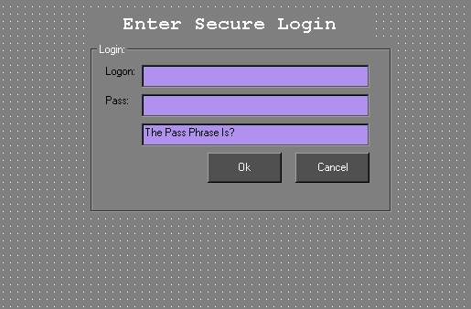



## Basic Pc Login

### Description

*UPDATES* 'For Windows 98, does not seem to work for win2000 or NT, sorry* Simple PC Login. Disables CTRL+ALT+DELETE!

Add this to your windows starup or whatever.

The password is set under the "getid$" section of the ok button.

BE SURE TO SET THIS YOURSELF! DEFAULT IS "testprogram".

!!!!!!!!

----

>DO NOT RUN THIS UNLESS YOU KNOW THE PASSWORD<

----

!!!!!!!!

YOU WILL BE LOCKED OUT OF WINDOWS!

This Is NOT, I repeat NOT A SECURE WAY TO PROTECT YOUR PC. Anyone reading the program is NOTEPAD can steal the password. ITs just a BASIC way to learn how to disable the CTRL+ALT+DELETE and a SIMPLE login!!!

I take no responsibility for your use. Be Carefull not to forget your password!
 
### More Info
 
Remember to set your own password. Dont leave the one I have set, this is just for example.

DONT FORGET PASSWORD, DISABLES CTRL+ALT+DELETE

'For Windows 98, does not seem to work for win2000 or NT.

The first three lines of the declaration and the disableCtrlAltDel function only remove the program from showing up under CTRL+ALT+DEL. It really isnt needed but incase someone manages to do this as windows loads, they would be able to cancel it from starting.

             |
---                |---
**Submitted On**   |2002-07-11 00:42:42
**By**             |[CrackHead](https://github.com/Planet-Source-Code/PSCIndex/blob/master/ByAuthor/crackhead.md)
**Level**          |Beginner
**User Rating**    |4.5 (18 globes from 4 users)
**Compatibility**  |VB 6\.0
**Category**       |[Miscellaneous](https://github.com/Planet-Source-Code/PSCIndex/blob/master/ByCategory/miscellaneous__1-1.md)
**World**          |[Visual Basic](https://github.com/Planet-Source-Code/PSCIndex/blob/master/ByWorld/visual-basic.md)
**Archive File**   |[Basic\_Pc\_L1047427112002\.zip](https://github.com/Planet-Source-Code/crackhead-basic-pc-login__1-36793/archive/master.zip)

